  

- ☁️ Cloud & DevOps engineer, building serverless architectures and CI/CD pipelines on AWS
- 🛠️ Recently shipped a serverless to-do app with Terraform IaC, cutting deployment time by ~80%
- 🌸 Looking to collaborate on cloud infrastructure and DevOps automation projects
- 💌 Reach me at fredaesiofori905@gmail.com
- 📍 Accra, Ghana

 

## 🪐 My Stack in Orbit

  

## 💜 Tech Stack

  

## 🌷 Featured Projects

<table>
  <tr>
    <td width="50%">
      <h4>☁️ Serverless To-Do App on AWS</h4>
      Lambda, API Gateway, DynamoDB, SNS — provisioned with Terraform. CI/CD via GitHub Actions cut manual deployment work by ~70%.
    </td>
    <td width="50%">
      <h4>🐳 Event Registration System</h4>
      Dockerized app with Prometheus + Grafana monitoring, deployed across 21 environments. Zero-downtime Kubernetes scaling.
    </td>
  </tr>
  <tr>
    <td width="50%">
      <h4>🏗️ AWS Cloud Architecture Capstone</h4>
      Production-style architecture: EC2, S3, CloudFront, ALB, Auto Scaling. Secure SSH-free management via AWS SSM.
    </td>
    <td width="50%">
      <h4>💸 SmartSpend</h4>
      Cloud-hosted expense tracker for students in Ghana — automatic categorization, budget alerts, savings goals.
    </td>
  </tr>
</table>

