  

- ☁️ Cloud & DevOps engineer studying Cloud Computing & AI at Azubi Africa, with a background in Computer Science (Accra Technical University)
- 🚀 Built a serverless AWS to-do app (Lambda, API Gateway, DynamoDB) with Terraform IaC, cutting deployment time by ~80%
- 🐳 Containerized and scaled a Kubernetes deployment with zero-downtime rollouts, monitored with Grafana + Prometheus
- 🏗️ Designed a production-style AWS architecture (EC2, S3, CloudFront, ALB, Auto Scaling) with a 4-person team
- 🌱 Looking to collaborate on cloud infrastructure, DevOps automation, and AI-assisted development projects
- 💌 Reach me at fredaesiofori905@gmail.com
- 📍 Accra, Ghana

 

## 🪐 My Stack in Orbit

  

## ☁️ Cloud & DevOps / Backend / Web Development / AI

<table>
<tr>

<td align="center" width="110">

 <b>AWS</b>
Cloud Apps Scalable Deployments
</td>

<td align="center" width="110">

 <b>Docker</b>
Containerized Apps Reliable Environments
</td>

<td align="center" width="110">

 <b>Terraform</b>
Automated Infra AWS Provisioning
</td>

<td align="center" width="110">

 <b>Kubernetes</b>
Cloud Orchestration Deployment Practice
</td>

<td align="center" width="110">

 <b>Firebase</b>
App Backends Real-time Data
</td>

<td align="center" width="110">

 <b>React</b>
Interactive UIs Modern Web Apps
</td>

</tr>

<tr>

<td align="center" width="110">

 <b>Node.js</b>
API Development Backend Services
</td>

<td align="center" width="110">

 <b>JavaScript</b>
Dynamic Features Web Solutions
</td>

<td align="center" width="110">

 <b>Claude</b>
AI Research Problem Solving
</td>

<td align="center" width="110">

 <b>ChatGPT</b>
Debugging Support Technical Learning
</td>

<td align="center" width="110">

 <b>Copilot</b>
AI-Assisted Coding Faster Development
</td>

</tr>
</table>
