  

- ☁️ Cloud & DevOps engineer studying Cloud Computing & AI at Azubi Africa, with a background in Computer Science (Accra Technical University)
- 🚀 Built a serverless AWS to-do app (Lambda, API Gateway, DynamoDB) with Terraform IaC, cutting deployment time by ~80%
- 🐳 Containerized and scaled a Kubernetes deployment with zero-downtime rollouts, monitored with Grafana + Prometheus
- 🏗️ Designed a production-style AWS architecture (EC2, S3, CloudFront, ALB, Auto Scaling) with a 4-person team
- 🌱 Looking to collaborate on cloud infrastructure, DevOps automation, and AI-assisted development projects
- 💌 Reach me at fredaesiofori905@gmail.com
- 📍 Accra, Ghana

 

## 🪐 My Stack in Orbit

  

## ☁️ Cloud & DevOps
<table>
  <tr>
    <td align="center" width="96">
      
       AWS
    </td>
    <td align="center" width="96">
      
       Docker
    </td>
    <td align="center" width="96">
      
       Terraform
    </td>
    <td align="center" width="96">
      
       Kubernetes
    </td>
    <td align="center" width="96">
      
       GitHub Actions
    </td>
    <td align="center" width="96">
      
       Grafana
    </td>
    <td align="center" width="96">
      
       Linux
    </td>
  </tr>
</table>

## 🔥 Backend

<table>
  <tr>
    <td align="center" width="96">
      
       Firebase
    </td>
  </tr>
</table>

## 🌐 Web Development

<table>
  <tr>
    <td align="center" width="96">
      
       Node.js
    </td>
    <td align="center" width="96">
      
       Vite
    </td>
    <td align="center" width="96">
      
       React
    </td>
    <td align="center" width="96">
      
       JavaScript
    </td>
  </tr>
</table>

## 🤖 AI & Automation
<table>
  <tr>
    <td align="center" width="96">
      
       Claude
    </td>
    <td align="center" width="96">
      
       ChatGPT
    </td>
    <td align="center" width="96">
      
       Google AI Studio
    </td>
    <td align="center" width="96">
      
       Google Stitch
    </td>
  </tr>
</table>

## 💡 AI Skills

<table>
  <tr>
    <td align="center" width="96">
      
       Prompt Engineering
    </td>
    <td align="center" width="96">
      
       AI Automation
    </td>
    <td align="center" width="96">
      
       GitHub Copilot
    </td>
  </tr>
</table>

  

